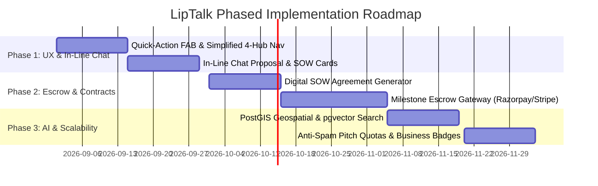

# 🚀 LIP TALK — Strategic Product, UI/UX & Architecture Improvement Plan

> **Executive Pitch:** *"The Direct, No-Broker Matchmaking Engine for Universal B2B, Professional & Commercial Growth."*

---

## 📌 1. Executive Summary & Core Value Proposition

Like **NoBroker** and **99acres** disintermediated real estate by directly connecting property owners and tenants through parametric search and direct contact, **LipTalk** eliminates friction, middlemen, and agency markups across the entire professional and commercial landscape.

### The Universal Value Loop
$$\text{Structured Need / Offer} \longrightarrow \text{Multi-Factor Match Radar} \longrightarrow \text{Direct Contextual Chat} \longrightarrow \text{In-Line Digital SOW} \longrightarrow \text{Milestone Escrow} \longrightarrow \text{CRM Lead} \longrightarrow \text{Closed Deal}$$

```
+-----------------------------------------------------------------------------------+
|                           THE PARALLEL COMPARISON                                 |
+------------------------------------+----------------------------------------------+
| 99acres / NoBroker (Real Estate)   | LipTalk (Universal Business & Growth Network)|
+------------------------------------+----------------------------------------------+
| Landlord lists a 2BHK flat         | Provider posts an Offer / Service / Product  |
| Tenant posts requirement (Budget)  | Buyer posts a Need / Demand / Project Scope  |
| Location & Rent Bracket Match      | Category + Skill + Geo-Radius + Budget Match |
| Direct chat with owner (No broker) | Contextual direct chat + CRM lead conversion |
| Rental agreement & RentPay Escrow  | Digital Milestone SOW & Escrow Payouts       |
| Single Vertical (Housing only)     | Universal (IT, Logistics, Law, Design, FMCG) |
+------------------------------------+----------------------------------------------+
```

---

## 🎨 2. UI & UX Transformation Roadmap

### 2.1. Navigation & Screen Hierarchy Simplification
* **Challenge:** The current app contains 47 individual screen routes, which can overwhelm new users.
* **Proposed Solution:** Group related screens under **4 Core Hubs**:
  1. **Discover Hub (Home):** Match Radar, Top Requirements, Guild Live Rooms, and Quick Search.
  2. **Demands & Deals Hub:** Open RFQs, Proposals Sent/Received, and Milestone CRM Pipeline.
  3. **Guilds & Network Hub:** Community Guilds, Live Voice/Video Masterclasses, and Partner Directory.
  4. **Workspace & Profile Hub:** Business Profile, Needs & Offers Management, Wallet, and Settings.

---

### 2.2. Universal Quick-Action FAB (Floating Action Button)
Add a persistent, animated **`+` Action Button** on the mobile & web navigation bar:
* 📝 **Post a Requirement (Need):** Opens 3-step structured scope wizard.
* 💼 **Publish Service / Capability (Offer):** Adds listing with pricing model (Fixed / Hourly / Retainer).
* 🎙️ **Go Live / Start Masterclass:** Launch an instant audio/video room in a Guild.
* 🤝 **Create Collaboration SOW:** Initiate a digital milestone contract.

---

### 2.3. Explainable Match Radar UI Redesign
Transform the standard list card into an **Interactive Match Synergy Card**:
* **Synergy Ring (Radial percentage score 95%):** Visual color-coded breakdown.
* **Expandable Factor Pills:**
  * `[Direct Domain: 30%]` `[Skills Overlap: 20%]` `[Local Hub: 10%]` `[Reciprocal Synergy: +10%]`
* **1-Tap Actions:**
  * `[Instant Chat with Context]` (Pre-fills chat with matched need/offer summary).
  * `[Save to CRM Pipeline]`.

---

### 2.4. In-Line Deal Workspace inside Chat
Turn chat from a plain messaging interface into an **Active Transaction Room**:
* **In-Line Proposal Card:** Service providers can send a structured card within chat containing Deliverables, Milestones, and Price.
* **In-Line Milestone Approval & Signature:** The buyer can click `[Accept Proposal]` or `[Fund Milestone Escrow]` directly in the chat stream without switching tabs.

---

### 2.5. Guided Onboarding & RFQ Scope Builder
Prevent vague requirements (e.g. *"Need app fast"*) by introducing interactive smart templates:
* **Step 1: Vertical & Subcategory** (e.g., *IT $\rightarrow$ React Native / Mobile App*).
* **Step 2: Technical Specifications & Tags** (e.g., *Offline Sync, GPS Tracking, Payment Gateway*).
* **Step 3: Budget Range, Currency & Timeline** (e.g., *₹2,50,000 - ₹3,50,000 | 45 Days*).

---

## 💼 3. Product & Business Model Enhancements

### 3.1. Milestone Digital SOW & Escrow Payments *(Highest Revenue & Trust Driver)*
* **The NoBroker Insight:** NoBroker’s primary monetization comes from **Rental Agreements and RentPay Transactions**.
* **LipTalk Implementation:**
  1. Generate standardized 1-page digital **Statement of Work (SOW)** contracts with digital sign-off.
  2. Integrate **Milestone Escrow** (via Razorpay / Stripe / Escrow APIs):
     * Buyer deposits milestone funds into escrow.
     * Provider delivers milestone deliverables.
     * Buyer approves release of funds upon verification.
  3. **Platform Take-Rate:** 2% - 5% processing fee on milestone releases (or 0% for Pro Enterprise Subscribers).

---

### 3.2. Anti-Broker & Anti-Spam Gatekeeping (Quality Assurance)
* **The Risk:** Open platforms often suffer from low-quality spam bids and middleman brokers.
* **Protective Features:**
  * **Verified Business Badges:** Verified checkmarks based on business registration (GST / PAN / Corporate Domain email).
  * **Pitch Quotas (Stake-to-Pitch):** Free tier includes 5 high-priority pitches/month; Pro members receive 30+ pitches to prevent automated script spamming.
  * **Verified Review Ledger:** Client ratings and feedback can only be submitted after a verified closed deal or milestone completion.

---

### 3.3. Reciprocal Synergy Engine (B2B Exchange Credits)
* In business networking, mutual value exchange is common (e.g., Agency A needs Marketing; Agency B needs Mobile App Dev).
* **Feature:** Automatic detection and notification when two parties have complementary Needs and Offers:
  > *"Synergy Alert: GrowthPulse Media offers the Lead Gen you need, and needs the React Native app you build. Tap to propose a mutual collaboration deal."*

---

## 🛠️ 4. Technical & Engineering Roadmap

### 4.1. Database & Spatial Indexing
* **PostgreSQL + PostGIS Indexing:** Offload geo-distance radius calculations from memory to SQL spatial queries (`ST_DWithin`) for millisecond query performance across millions of geo-tagged businesses.
* **pgvector / AI Semantic Embeddings:** Store vector embeddings for all Needs, Offers, and Opportunities to enable natural language semantic search (e.g. *"Uber for agriculture"* $\rightarrow$ matches *"Logistics, GPS, Fleet Tracking"*).

---

### 4.2. Real-Time WebSocket & Mobile Push Reliability
* **Reconnection Resilience:** Implement automatic exponential backoff for Socket.io chat when switching between Wi-Fi and Mobile Data.
* **Smart Proactive Match Push Notifications:** Trigger instantaneous push notifications when a new high-compatibility ($>90\%$) demand is published in the user's category and city.

---

## 📅 5. Suggested Phased Implementation Plan



| Phase | Core Deliverable | Expected Impact |
| :--- | :--- | :--- |
| **Phase 1 (Weeks 1–4)** | **UX Simplification & In-Line Chat Deals** | Increases daily user engagement and streamlines the transition from chat to deal discussion. |
| **Phase 2 (Weeks 5–8)** | **Digital Milestone SOW & Escrow Payments** | Converts conversations into monetizable, legally binding transactions with platform revenue. |
| **Phase 3 (Weeks 9–12)**| **PostGIS Spatial Indexing & AI Vector Matching** | Sub-second match searches across large datasets and intelligent natural-language discovery. |
| **Phase 4 (Weeks 13–16)**| **Verified Business Badges & Pitch Quotas** | Protects the ecosystem from broker spam and enforces top-tier service quality. |

---

*Document created for team strategy and engineering alignment.*
